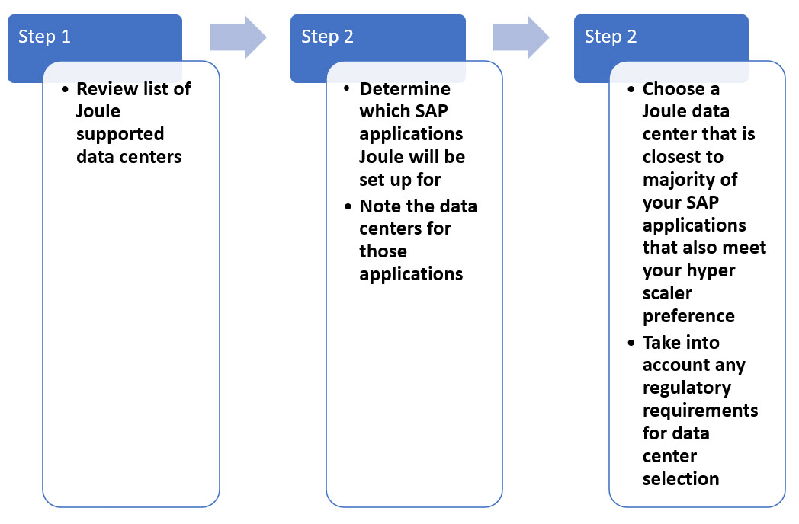

Before you can activate Joule there are certain number of pre-requisites that must be met.  This section describes those pre-requisites and outlines some details that need to be captured prior to running through the activation steps.

## 1. User Personas Required for Joule activation

Activation of Joule requires configuration in multiple systems.  It's important to have the right stakeholders involved when setting up the configuration.  In order to setup Joule the following user personas are required:
* Admins of the system for which Joule will be setup.  For example, SAP SuccessFactors, SAP S/4HANA Cloud Admin etc.
* SAP BTP Global Account Admin
* SAP Cloud Identity Services Admin
  
## 2. Verify Global Account Entitlements

1. Access [BTP Cockpit URL](https://cockpit.btp.cloud.sap).
2. Select the BTP Global Account and click Continue. 
   
3. From the Navigation Panel expand **Entitlements** and click **Service Assignments**.
4. Search for **Joule** and validate that plan below is available.
   
    | Application     | Technical Name | Plan        | Required Quota | Remaining Quota |
    | ----------- | ----------- | ----------- | -------------- | --------------- |
    | Joule      | das-application      | foundation       |     1            |          limited       |
  
    

5. Clear existing search text and search for **SAP Build Work Zone, standard edition**.  Validate that following 2 plans are available for SAP Build Work Zone:

    | Application     | Technical Name | Plan        | Required Quota | Remaining Quota |
    | ----------- | ----------- | ----------- | -------------- | --------------- |
    | SAP Build Work Zone, standard edition   | SAPLaunchpad       | foundation or standard       |      1           |       limited          |
    | SAP Build Work Zone, standard edition      | build-workzone-standard      | foundation or standard      |     1            |          limited       |
  
       
  If the entitlements are not visible, it could be due to one of these reasons:
    1) You don't have licenses for Joule.
    2) Joule entilements were added to different BTP Global Account to which you don't have Global Account Admin access.
    3) The start date for the Joule contract is at future date hence the entilements won't be visible in BTP until that date.
  In the scenarios above, please work with Account Executive, BTP Customer Success Partner or SuccessFactors Customer Success Partner to resolve the entitlements issue prior to proceeding further with this mission.

## 4. Choose Data Center for Joule Setup

Joule is BTP Service that works with multiple SAP solutions.  The number of SAP applications supported with Joule is growning on a regular basis so it's important to choose a data center for Joule setup that can work for various SAP applications you may have in your landscape.  There are several factors that determine which data center to choose for Joule setup.  Some factors to consider:
1)  What are the currently supported datacenters for Joule?
2)  Which SAP solutions will Joule be setup for and what are datacenters of those solutions?
4)  Are there any legal requirements to choose a datacenter in particular region?

It's important to choose the correct data center when creating the subaccount.  How do you determine which data center to choose whAs part of the activation steps we need to leverage SAP Cloud Identity Provisioning Service to read users from SuccessFactors and provision them to SAP Build Work Zone.  This requires that SAP Build Work Zone, standard edition is available as a connector under target systems in SAP Cloud Identity Provisioning Service (IPS).  This connector may not be available on IPS tenants running on NEO landscapes.  It's recommended customers migrate IPS from NEO to IPS running on SAP Cloud Identity Provisioning Service (SCI) landscape.  In most cases this migration can be done in a matter of minutes.  For more information on how to perform this migration, refer to the following links:
* [Blog: Go for your quick win! Migrate Identity Provisioning tenants to SAP Cloud Identity infrastructure](https://community.sap.com/t5/technology-blogs-by-sap/go-for-your-quick-win-migrate-identity-provisioning-tenants-to-sap-cloud/ba-p/13536739)
* [Help Documenation: Migrate Identity Provisioning Bundle Tenant](https://help.sap.com/docs/identity-provisioning/identity-provisioning/migrate-identity-provisioning-bundle-tenant)

## 8. Determine SuccessFactors Data Center

To validate whether SuccessFactors instance can be setup for Joule, you will need to find the correct data center for your SAP SuccessFactors instance.  To learn more, visit [2089448 - SuccessFactors Data Center Name, Location, Production Login URL, Production Domain Name, External Mail Server Details and Outbound IP addresses](https://me.sap.com/notes/0002089448)

For example, DC68 data center tenants the screenshot shows the corresponding SuccessFactors tenant URLs. 

**Note**: If your SuccessFactors tenant is using common super domain, make note of the **Pre CSD Migration URL** of your tenant as well.  This URL will be used when running the booster in the BTP Global Account.

## 9. Verify SuccessFactors Data Center

SAP Joule is supported in subset of the SAP SuccessFactors datacenters.  Confirm that your SuccessFactors tenant is in the list of supported data centers for Joule.  See the list of [Data Center Mapping between SAP SuccessFactors and Joule](https://help.sap.com/docs/joule/serviceguide/data-center-mapping-between-sap-successfactors-and-joule).

## 10. Find API URLs for SuccessFactors tenant

We need to know the **API Server** and **mTLS Certificate Server** URLs for our SuccessFactors tenant.  This information can be found here: [List of SFSF API Servers](https://help.sap.com/docs/SAP_SUCCESSFACTORS_PLATFORM/d599f15995d348a1b45ba5603e2aba9b/af2b8d5437494b12be88fe374eba75b6.html) 

For example, for DC68 production SuccessFactors tenants the corresponding **API Server** and **mTLS Certificate Server** URLs for our SuccessFactors tenant are:   
* **API Server**: https://api4.successfactors.com/                         
* **mTLS Certificate Server**: https://api4.cert.successfactors.com

## 11. SAP Cloud Identity Services tenant(s) and SuccessFactors Details

To setup Joule, the SuccessFactors tenant should already be integrated to use SAP Cloud Identity Service.  To find out which IAS/IPS instance the SuccessFactors tenant is using access **Admin Center >> Monitoring Tool for Identity Authentication Service/Identity Provisioning Service Upgrade**.  Make a note of the **Identity Authentication Service Tenant URL** and **Identity Provisioning Service Tenant URL**.  When setting up the BTP subaccount trust with IAS in later steps, it will be important to select the same IAS tenant that is used by SuccessFactors.  In addition, the date of when the activatation was done will be important to pick the right domain to use when setting up BTP Subaccount trust to SAP Cloud Identity Authentication Service (IAS).  

## 12. Domain used for SuccessFactors trust with SAP Cloud Identity Services

In addition to knowing the URL of SAP Cloud Identity Services tenant, we also need to know which domain was used during the integration between SuccessFactors and SAP Cloud Identity Authentication Service.  Use the table below to determine which domain is relevant for your integration:

| Criteria     | Domain to Use |
| ----------- | ----------- |
| SuccessFactors tenant already migrated to common super domain   | ias.accounts.**cloud.sap**     | 
| **Initiate the SAP Cloud Identity Services Identity Authentication Service Integration** job triggered **after Nov 20, 2023** in Upgrade Center   | ias.accounts.**cloud.sap**     | 
| **Initiate the SAP Cloud Identity Services Identity Authentication Service Integration** job triggered **before Nov 20, 2023** in Upgrade Center   |ias.accounts.**ondemand.com**     | 

Knowing which domain to use is relevant when setting up trust between BTP Subaccount and SAP Cloud Identity Authentication Service in later steps.

## 13. Validate SuccessFactors IP Restriction Management

Some of our SuccessFactors customers have IP restrictions in place to prevent user access to SuccessFactors from outside of that IP range.  For more information on IP Restriction Management in SuccessFactors follow this SAP Note: [2089414 - System: How to restrict access to SuccessFactors by IP address - IP Restriction Management](https://userapps.support.sap.com/sap/support/knowledge/en/2089414).  If such IP restrictions are in place then the IPs of BTP data center where Joule will be setup must also be added to the list of whitelisted IPs. To see the list of BTP datacenters and the corresponding IPs, follow [Regions and API Endpoints Available for the Cloud Foundry Environment](https://help.sap.com/docs/btp/sap-business-technology-platform/regions-and-api-endpoints-available-for-cloud-foundry-environment) 

**WARNING**: DO NOT add the BTP IPs unless you are already restricting user access to SuccessFactors based in IPs.  Please read note 2089414 in detail before making any changes in the **IP Restriction Management** app in SuccessFactors.
