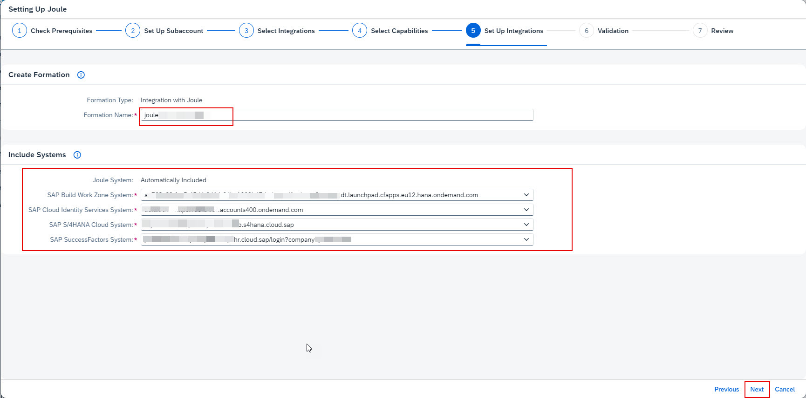

1. If necessary, navigate to your BTP Global Account. 

2. From the Navigation Pane on the left, click **Boosters** >> search for **Joule** >> click **Start** on Setting up Joule tile. 

3. Confirm the pre-requisites check is successful and click **Next**. 

4. From the Subaccount dropdown select the **Joule** subaccount created earlier and click **Next**. 

5. From the Products dropdown select all SAP applications which will be setup with Joule.  For example, SAP S/4HANA Cloud and SAP SuccessFactors in my setup. 
 Choose whether the integration is for **Testing or Production** and click **Next**. 

6. Confirm the selected applications chosen in previous step are listed under the Capability Pacakages dropdown. Click **Next**. 

7. Leave the default **Formation Name**.  From the SAP SuccessFactors System dropdown choose the SuccessFactors system registered under the BTP System Landscape in earlier steps.  For SAP Start System, select the SAP Build Work Zone subscription that you created earlier in BTP subaccount.  Click **Next**.  

8. Confirm the validation check is successful and click **Next**. 
  

9. Review the configuration settings and click **Finish**. 
  

10. Confirm the booster execution is successful and click **Close**. 

