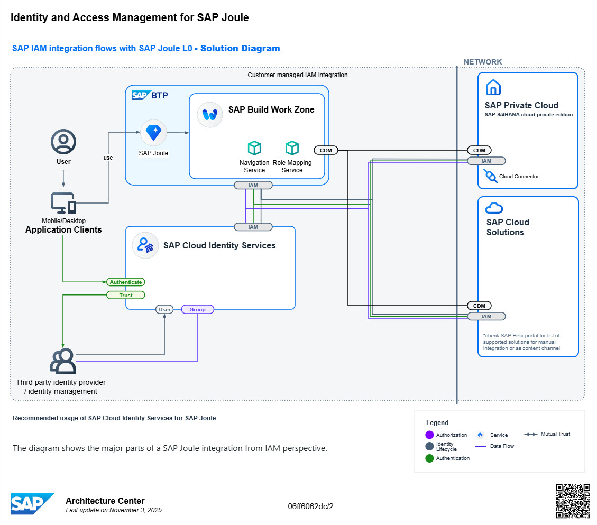

Joule is the AI copilot that truly understands your business. Joule revolutionizes how you interact with your SAP business systems, making every touch-point count and every task simpler.

It enables the companion of the Intelligent Enterprise, guiding you through content discovery within the SAP Ecosystem, and giving a transparent role-based access to the relevant processes from everywhere. This is the one assistant experience, a unified and delightful user experience across SAP’s solution portfolio.

Joule offers conversational interactions between humans and computers to simplify access to information and automate business processes, thus improving both the employee and customer satisfaction. Joule can direct you to the right application to complete your tasks, help you to complete certain tasks, and find the information your looking for quickly and easily.

Joule is a BTP service that can be hosted in multiple environments and data centers:  Refer to [Data Centers Supported for Joule](https://help.sap.com/docs/joule/serviceguide/data-centers-supported-by-joule).

The setup process for Joule with SuccessFactors requires integration across multiple SAP components as depicted in the picture below. 

This purpose of this guide is to provide step by step instructions on how to set up Joule with SAP SuccessFactors.

